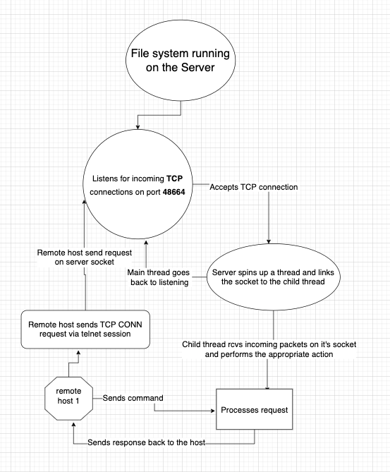
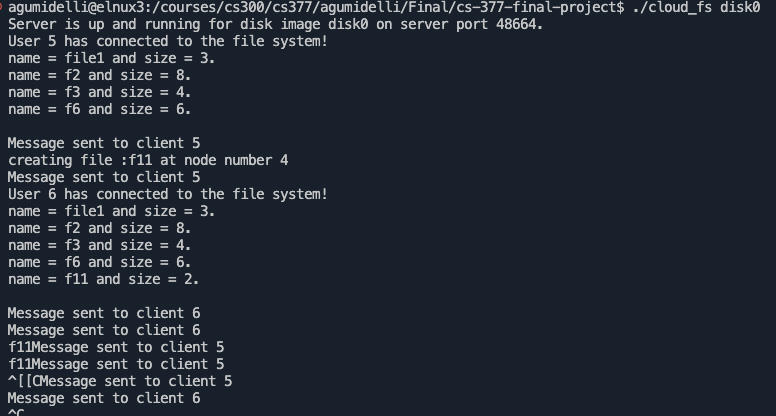
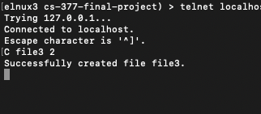
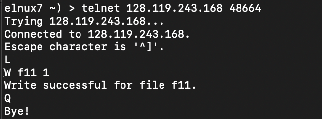

# CS-377-final-project -- ANURAG GUMIDELLI

## CLOUD MANAGED SHARED FILE SYSTEM

This project is an extension of the File_system Project given in class.

### Key Additions
- Multiple user access at the same time to the File system
- Files exist in the cloud (distributed system)
- Cloud Logs for user actions
- Atomic operations, all user actions which affect the memory are serializable, i.e have a sequence of actions, and has a stable state
- Memory is safegaurded by a Lock
- File system is accesible from any device which can reach the server via local network or via internet

## APPLICATION DESIGN

- Server TCP socket listens for incoming connections
- Spins child threads that attach themselves to the full socket that is connected to the remote user host
- Lock to make the memory unit operations atomic
- Lock to make the memory read/write operations thread safe
- Shared memory unit




## SERVER SETUP

```bash
# move to the root folder of the project
make
./create_fs disk0
./cloud_fs disk0
```

After deploying the server check the ipv4 address of the server machine

## Connecting to the File System

```bash
telnet <server_ip> 48664
```

## Commands available
```bash
C <fileName> <numBlocks>    #   Create File
D <fileName>                #   Delete File
R <fileName> <blockNum>     #   Read File at block
W <fileName> <blockNum>     #   Write File at block
L                           #   List the current files
```

## **Example server client session**

**Below is an example of a server hosting disk0 and remote host 1 and remote host 2 interacting with the server**

### Server Log



### Remote host 1 Log



### Remote host 2 Log



